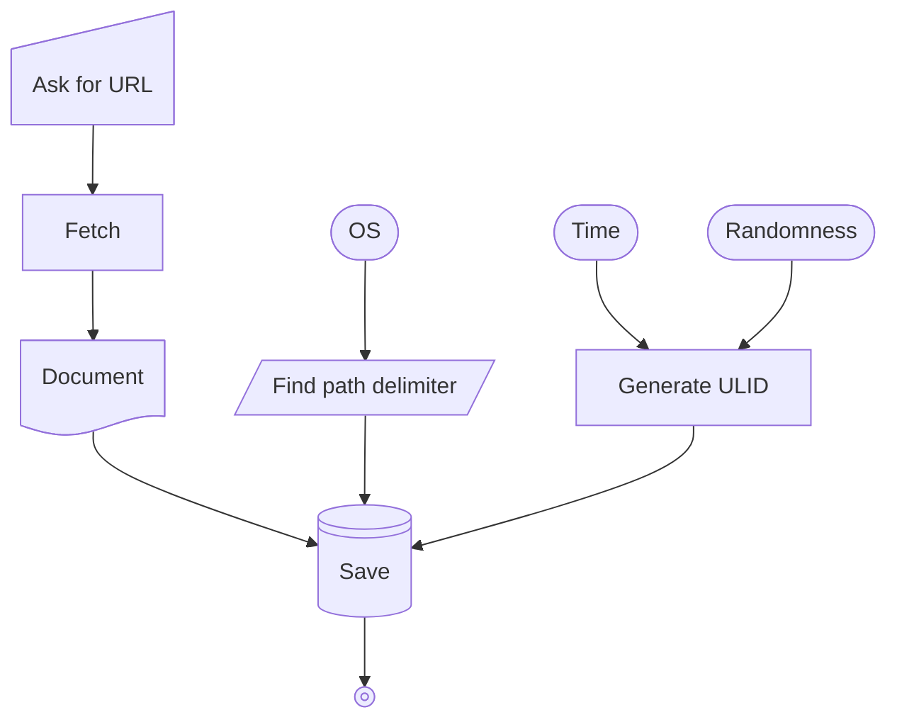

# Airfox
Airfox is a simple web browser / content fetcher based on Markdownee. It runs on Node.js.
## Process Flowchart

## Installation
run:
```bash

npx playwright install firefox ffmpeg webkit
bash ./install.sh
node airfox.mjs
```
or on Windows:
```bat

npx playwright install firefox ffmpeg webkit
install.bat
node airfox.mjs
```
## License
MIT license.\
see `LICENSE`.
